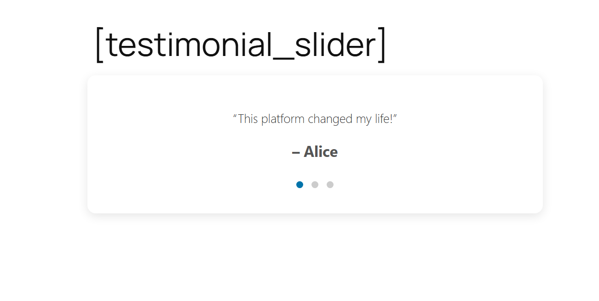
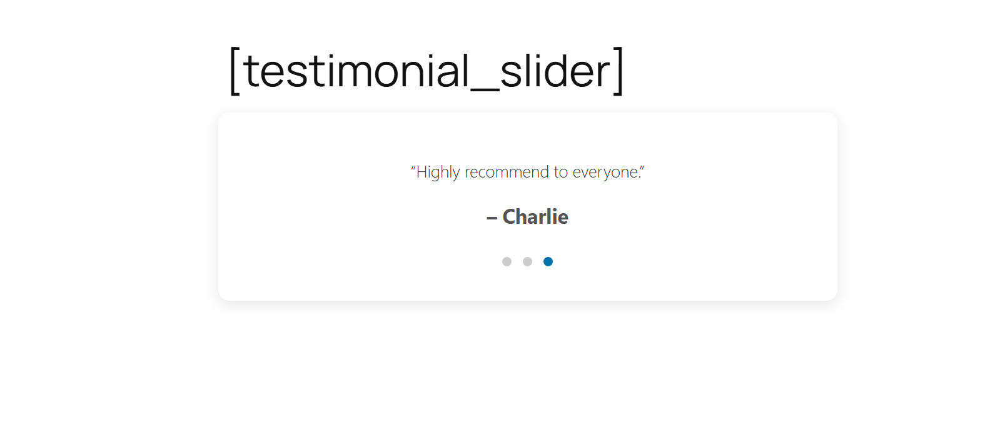
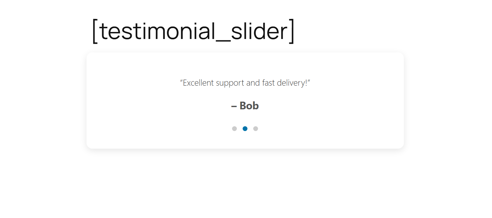

# WP Testimonial Slider

A lightweight and responsive WordPress plugin to display testimonials in a slider format using shortcodes.

## 🚀 Features

- Built with PHP, JavaScript, and CSS
- Custom shortcode: `[testimonial_slider]`
- Auto-rotating testimonials with smooth transitions
- Responsive card layout with hover effects
- Clean, beginner-friendly code

## 🔧 Installation

1. Copy the `wp-testimonial-slider` folder to your WordPress `wp-content/plugins/` directory
2. Go to WordPress Admin → Plugins → Activate **WP Testimonial Slider**
3. Add the shortcode `[testimonial_slider]` to any page or post

## 📸 Screenshot

## 🛠️ Technologies Used

- PHP (WordPress plugin architecture, shortcode)
- JavaScript (auto slider logic, DOM handling)
- CSS (card layout, transitions, hover effects)

## 🧠 Author

Built with ❤️ by **Ranjeet Yadav**
